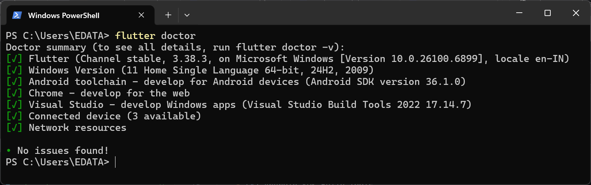
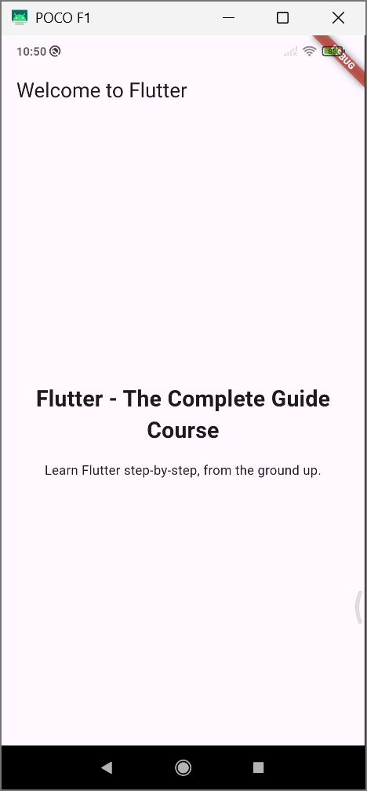

# Section 01 - Introduction

## Installation

> [📄 Installation Manual](https://docs.flutter.dev/install/manual)

!!! info "Requirements"
    {==Git==} and {==Android Studio==} for SDK Manager

- Extract the flutter zip file and place it in `C:\src\`.
- Need to add the flutter in the Environment path `C:\src\flutter\bin`.
- Install Android Studio with Emulator as optional.
- Go to SDK Manager and install these in SDK Tools.
    - [x] Android SDK Build Tools
    - [x] Android SDK Command-Line Tools
    - [x] Android Emulator
    - [x] Android Emulator hypervisor driver
    - [x] Android SDK Platform-tools
- Then run `flutter doctor` to check everything in working fine.


## Getting Started

- To create flutter app run

```shell
flutter create first_app
```

- Start the android emulator or connect an android device to run the app
- Then `cd` into the folder and run the app

```shell
cd first_app
flutter run
```

{ width="250" }
